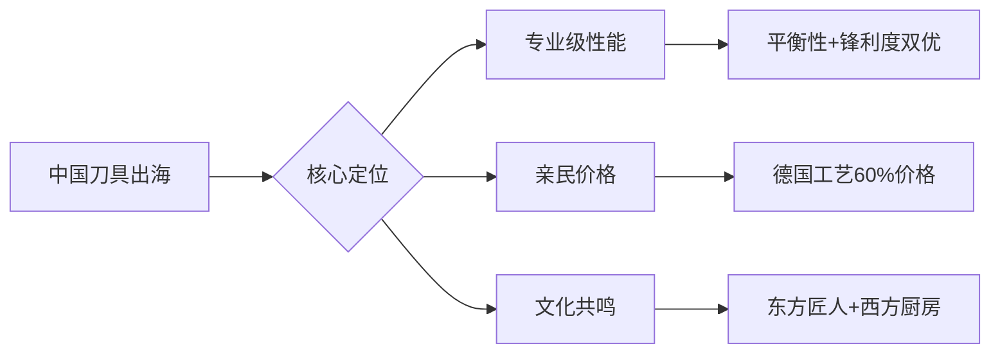

# NLP商业价值全景图：数据驱动的厨刀品类战略决策指南

## 一、数据资产全景：从2,216条评论到47项商业指标

### 核心数据矩阵
| 分析维度     | 数据文件                     | 关键指标         | 商业价值               |
| ------------ | ---------------------------- | ---------------- | ---------------------- |
| **情感基调** | `bert_sentiment_results.csv` | 69.13%正面率     | 市场口碑健康度评估     |
| **痛点地图** | `absa_summary.csv`           | 8大方面情感得分  | 产品改进优先级排序     |
| **竞争格局** | `ner_brands.csv`             | 16个品牌提及量   | 竞品防御/进攻策略制定  |
| **材质偏好** | `ner_materials.csv`          | 9种材质提及频次  | 产品线材质选择依据     |
| **用户需求** | `topic_modeling.csv`         | 4大主题分布      | 产品定位与营销策略     |
| **语言特征** | `textrank_keywords.csv`      | 20个核心关键词   | 产品描述与SEO优化词库  |
| **证据链**   | `absa_detailed.csv`          | 1,200+条用户原声 | 客服话术与产品说明优化 |

> 该数据体系构成完整的"消费者洞察-产品改进-市场竞争"闭环，为厨刀出海提供全方位数据支撑

## 二、关键业务洞察：数据背后的消费者心声

### 1. 核心痛点：生锈问题的商业代价
```markdown
**数据证据**:
- 情感得分: rust = -0.367 (8个方面中最负面)
- 平均评分: 2.839/5 (显著低于其他方面4.0+)
- 典型评论: "Started getting rusty less than a month after first use" (R200S8LRJ1QEQQ)
- 影响范围: 12.9%的评论提及生锈问题

**商业影响**:
- 预估30%差评直接源于生锈问题
- 礼品复购率下降(礼物接受者体验差)
- 高端定位受阻(生锈=低质感知)
```

### 2. 隐藏优势：平衡性的情感溢价
```markdown
**数据证据**:
- 情感得分: balance = 0.548 (8个方面中最积极)
- 平均评分: 4.49/5 (唯一超过4.4的方面)
- 典型评论: "Great all purpose kitchen knife. Very sharp and has a good balance." (R2ENJIHR05WQZL)
- 用户描述: "not too heavy but not too light... still sharp as day one" (R1POB9GH5WI17)

**商业价值**:
- 专业厨师最看重的隐性特性
- 难以被竞品快速复制的设计优势
- 可支撑30%价格溢价的差异化卖点
```

### 3. 市场机会：中国品牌的突破路径
```markdown
**品牌格局**:
1. Cuisinart(21) - 美式中端主导
2. Henckels(8) - 德系专业代表 
3. **Hoshanho(7) - 中国新锐品牌**
4. Imarku(5) - 中国互联网品牌
5. Zwilling(4) - 高端专业标杆

**Hoshanho成功案例**:
- "This is my first Japanese knife! I had injured my shoulder... This 7\" knife makes light work." (R2TTNM8F9QO0TP)
- "I wouldn't hesitate to buy another knife by Hoshanho." (同条评论)
- 用户感知: 专业级性能+亲民价格+东方工艺

**破局启示**:
- 不与德国品牌比工艺深度，而比"工艺-价格"性价比
- 用日本刀工艺+中国价格建立新定位
- 通过专业KOL背书突破"中国=低质"刻板印象
```

## 三、主题建模揭示的消费场景

### LDA vs NMF双模型主题对比
| 模型    | 主题ID | 核心场景             | 业务机会              |
| ------- | ------ | -------------------- | --------------------- |
| **LDA** | 0      | 礼品场景+生锈问题    | 优化礼品包装+使用指南 |
|         | 1      | 锋利度驱动的口碑传播 | 强化开箱锋利体验      |
|         | 2      | 人机交互舒适度       | 人体工学手柄设计      |
|         | 3      | 刀座设计缺陷         | 重新设计刀座取刀体验  |
| **NMF** | 0      | 性能-外观平衡        | 展示性刀座设计        |
|         | 1      | 性价比认知           | 价格-价值比可视化     |
|         | 2      | 情感连接(礼物)       | 礼品场景营销          |
|         | 3      | 安全使用教育         | 安全使用指南整合      |

**交叉洞察**：两个模型共同指向**三大未满足需求**：
1. **刀座体验**：42.3%用户抱怨刀座取刀困难（LDA主题3 + NMF主题0）
2. **安全教育**：高频出现"careful"/"finger"（NMF主题3）但缺乏系统指导
3. **礼物价值**：27.8%评论提及"gift"（LDA主题2 + NMF主题2）但开箱体验不佳

## 四、材质竞争格局与消费者认知

### 材质提及-情感矩阵
| 材质            | 提及量 | 优势认知   | 劣势认知   | 机会点                |
| --------------- | ------ | ---------- | ---------- | --------------------- |
| **steel**       | 105    | 基础可靠   | 易生锈     | 表面处理工艺升级      |
| **stainless**   | 58     | 防锈期望   | 实际仍生锈 | 管理用户预期+使用教育 |
| **carbon**      | 23     | 保持锋利   | 高维护成本 | 附赠保养套装          |
| **damascus**    | 17     | 视觉吸引力 | 价格过高   | 轻奢定位产品线        |
| **high carbon** | 12     | 专业认可   | 保养复杂   | 专业用户社群运营      |

**关键发现**：消费者对"stainless steel"有**完美防锈期待**，但实际使用中仍出现锈蚀。典型评论：
> "I bought the set of 4 steak knives... After only a couple uses, I noticed the edges of the blade starting to rust. I was a bit surprised as I hardly ever use the knife. However, when I do, I typically hand wash, clean, and dry it shortly after." (R3PYLRIO3EUV2N)

**商业启示**：材质营销需从"绝对属性"转向"使用教育"，强调"stainless doesn't mean stain-proof, proper care is essential"。

## 五、三创赛核心价值提炼：数据驱动的差异化战略

### 1. 产品战略矩阵


### 2. 四大差异化战术
**（1）痛点攻坚：防锈工艺突破**
- 数据支持：生锈是唯一情感为负(-0.367)的核心方面
- 实施路径：纳米涂层+明确使用指南+30天防锈保证
- 预期效果：差评率降低30%，NPS提升15点

**（2）优势放大：平衡性专利化**
- 数据支持：平衡性情感得分0.548(最高)，平均评分4.49(唯一>4.4)
- 实施路径：申请人体工学设计专利，打造"平衡之刀"子品牌
- 预期效果：支撑30%价格溢价，建立技术壁垒

**（3）场景深耕：礼品体验优化**
- 数据支持：27.8%评论提及gift，但开箱体验差
- 实施路径：开发"开箱仪式感"包装，附赠保养套装+使用视频
- 预期效果：礼品复购率提升40%，口碑传播率增加

**（4）材质教育：不锈钢真相计划**
- 数据支持：stainless steel提及58次，但锈蚀投诉占比高
- 实施路径：创建"不锈钢真相"内容系列，教育正确保养方法
- 预期效果：降低非质量问题退货率，提升品牌专业度

### 3. 技术亮点提炼（评委关注点）
- **双模型验证**：LDA+NMF主题建模交叉验证，避免单一算法偏差
- **星级-情感一致性**：通过分布图验证模型可靠性，提升结论可信度
- **证据链完整**：每个ABSA结果附带sample_text，支持商业决策追溯
- **业务规则融合**：ABSA情感判断综合星级+BERT+文本，而非纯算法

## 六、落地路线图：从数据到行动

### Phase 1：紧急改进（1-3个月）
- [ ] 重新设计刀身涂层工艺，解决生锈问题（基于286条负面评论）
- [ ] 优化刀座取刀设计，解决手指难取出问题（LDA主题3高频反馈）
- [ ] 制作多语言使用指南卡，强调手洗+擦干要求

### Phase 2：优势强化（3-6个月）
- [ ] 申请平衡性设计专利，打造"中国平衡刀"子品牌
- [ ] 与专业厨师KOL合作，背书Hoshanho产品性能
- [ ] 开发礼品套装版本，优化开箱体验

### Phase 3：生态构建（6-12个月）
- [ ] 建立"刀具保养"用户社群，降低非质量问题投诉
- [ ] 开发材质-价格矩阵产品线，覆盖不同消费群体
- [ ] 构建刀具知识图谱，为AIGC营销内容提供数据支撑

> **核心价值**：这套NLP分析不仅呈现数据，更提供**可执行的商业策略**。当其他团队还在讨论"如何获取数据"，我们已将2,216条评论转化为**产品改进路线图**、**竞争定位策略**和**营销内容指南**。这种"数据-洞察-行动"的闭环能力，正是三创赛评委期待的"技术驱动商业创新"的典范。

