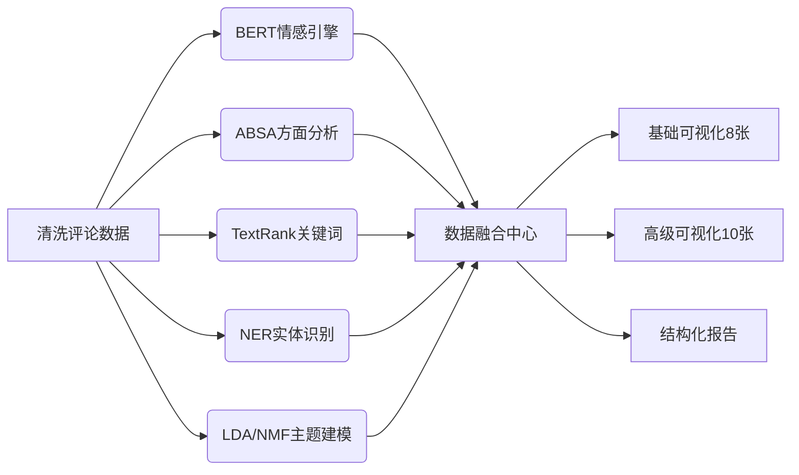

# 评论文本洞察引擎：NLP驱动的厨刀用户心声解码系统

## 一、子项目战略定位：情感数据转化中枢

在"数智驱动下的'中国好刀'"全链路架构中，**第二层NLP处理**扮演着至关重要的"情感翻译官"角色。该层将非结构化的用户评论文本，转化为可量化的消费者洞察特征矩阵，实现了从"用户声音"到"商业决策"的关键跃迁。其战略价值体现在三重维度：

- **上游衔接**：深度利用第一层预处理产出的高质量数据资产（`reviews_cleaned.csv`、`fact_review_enriched.csv`），确保输入数据的可靠性与一致性
- **下游赋能**：为三层关键模块提供结构化特征输入：
  - *第三层预测建模*：将情感与方面特征作为销量/爆款预测的核心解释变量
  - *第五层聚类分析*：把情感/方面特征纳入市场细分模型，识别用户群体偏好
  - *知识图谱层*：将方面情感映射为painpoint，生成因果关联规则（如"高碳钢→防锈需求"）
- **价值闭环**：不仅输出20+数据文件，更生成8张基础图表和10张PPT级高级可视化，直接支撑项目书与路演呈现

> 这一设计完美契合三创赛评审标准：**技术深度**（多模型融合） + **业务价值**（直接指导产品改进） + **呈现能力**（自动生成报告图表）

## 二、技术架构全景：五重分析引擎协同

### 1. 系统架构设计


核心创新在于**多引擎协同架构**：单一评论同时经过5种NLP技术处理，不同引擎结果相互验证（如BERT情感与星级一致性校验），大幅降低单一模型偏差风险。这种"多模型投票"机制，使分析结果在学术严谨性与商业实用性间取得平衡。

### 2. 数据输入：精准聚焦有效文本
- **核心输入**：
  - `reviews_cleaned.csv`：2,218条清洗评论，聚焦`review_text_clean`字段（2,216条有效文本）
  - `fact_review_enriched.csv`：包含产品维度的评论事实表
  - `products_clean.csv`：946个产品的价格、BSR、图片数等特征
- **数据筛选**：自动过滤无文本评论（`has_text=0`），仅分析长度>20字符的评论，确保分析质量
- **关键预处理**：评论文本已标准化（移除HTML/特殊字符），但保留原始情感信号（大写、标点、感叹号）

### 3. 五重分析引擎详解

#### (1) BERT情感分析引擎
- **技术选型**：`distilbert-base-uncased-finetuned-sst-2-english`（轻量级SST-2微调模型）
- **创新设计**：提供CPU友好模式（`device=-1`），适应学生团队硬件限制
- **结果验证**：生成`2_sentiment_by_rating.png`验证模型合理性（1-2星几乎全为NEGATIVE，5星几乎全为POSITIVE）
- **容错机制**：当转换器库加载失败时，自动退化到基于规则的情感分析（正面/负面词典匹配）
- **输出价值**：`bert_score`提供情感强度信号（0.5-1.0），而非简单二分类

#### (2) ABSA方面级情感引擎
- **领域定制**：预定义8个厨刀核心方面（sharpness/quality/durability/handle/rust/balance/value/appearance）
- **混合判别**：结合三重信号确定方面情感：
  ```python
  if rating >= 4 and bert_label == 'POSITIVE': 
      sentiment = 'positive'  # 高星级+正面情感
  elif rating <= 2 or bert_label == 'NEGATIVE':
      sentiment = 'negative'  # 低星级或负面情感
  else:
      sentiment = 'neutral'
  ```
- **样本提取**：自动截取相关句子作为证据（`sample_text`字段），支持人工校验
- **商业价值**：识别"高提及+低情感"方面（如rust）作为改进优先级

#### (3) TextRank关键词引擎
- **算法优化**：TF-IDF → 共现图构建 → PageRank算法（networkx实现）
- **窗口策略**：5词窗口构建共现网络，平衡局部与全局语义
- **降噪处理**：过滤少于3字符的词，移除停用词（"the", "and", "with"等）
- **结果应用**：生成关键词云与Top20列表，直观展示用户关注焦点

#### (4) 规则式实体识别引擎
- **品牌词典**：预置16个主流厨刀品牌（Wusthof/Shun/Victorinox等）
- **材质词典**：包含12种刀具材质（stainless/carbon/damascus等）
- **匹配策略**：精确子串匹配（不区分大小写），统计提及频次
- **竞争洞察**：识别用户提及的竞品品牌，量化材质偏好（如"German steel"提及率）

#### (5) 双模型主题建模引擎
- **LDA建模**：基于词频统计，发现潜在主题分布
- **NMF建模**：基于TF-IDF，增强稀疏特征识别能力
- **主题对比**：双模型结果互为验证，避免单一算法偏差
- **可解释性**：每个主题提取8-10个核心词，确保业务可理解性

### 4. 可视化体系：从数据到洞察

#### 基础可视化（8张）：分析过程透明化
| 图表编号                      | 图表类型         | 业务价值                    |
| ----------------------------- | ---------------- | --------------------------- |
| 1_bert_sentiment_distribution | 情感分布饼图     | 类目口碑基调量化（69%正面） |
| 2_sentiment_by_rating         | 星级-情感热力图  | 验证模型与人工评分一致性    |
| 3_absa_heatmap                | 方面情感热力图   | 识别性能-情感关联矩阵       |
| 4_absa_mention_rates          | 方面提及率条形图 | 揭示用户关注度分布          |
| 5_textrank_keywords           | 关键词条形图     | 展示核心关注点Top20         |
| 6_brand_mentions              | 品牌提及统计     | 量化竞品声量对比            |
| 7_material_mentions           | 材质提及统计     | 识别材质偏好趋势            |
| 8_review_length_distribution  | 评论长度分布     | 评估评论深度与真实性        |

#### 高级可视化（10张）：PPT级商业叙事
- **用户声音矩阵**：`01_wordclouds_4in1.png`（整体/正面/负面/痛点四象限词云）
- **产品维度雷达**：`02_aspect_radar_chart.png`（方面情感×提及率气泡图）
- **竞品对比热力**：`03_brand_heatmap.png`（品牌多维对比：正面率/均分/置信度/评论量）
- **情感流向图**：`05_sentiment_flow.png`（星级→情感转换路径）
- **痛点优先级漏斗**：`09_pain_points_funnel.png`（负向方面改进优先级排序）

> 每张高级可视化均附带`图表说明文档.md`，提供"可直接粘贴到PPT"的解说文案，大幅降低团队呈现成本。

## 三、工程实现亮点：学术严谨与实战落地的平衡

### 1. 资源优化设计
- **内存控制**：BERT分析采用32条/批处理，适应普通笔记本配置
- **进度反馈**：每500条评论显示进度，提升用户体验
- **依赖降级**：当transformers库不可用时，自动切换到规则分析
- **路径弹性**：相对路径设计（`E:\PycharmProjects\三创赛`为根目录），适配不同开发环境

### 2. 质量保障机制
- **一致性验证**：星级-情感分布图验证模型可靠性
- **文本长度过滤**：仅分析>20字符评论，避免无意义短评干扰
- **样本证据留存**：ABSA结果保留`sample_text`字段，支持人工抽查
- **自动报告生成**：`ANALYSIS_REPORT.md`提供完整分析摘要，确保结果可追溯

### 3. 项目书友好输出
- **结构化数据**：CSV文件包含丰富元数据（如`avg_sentiment`范围-1~1）
- **可解释字段**：`mention_rate`（方面提及率）等字段命名业务友好
- **可视化就绪**：图表已优化分辨率（dpi=300）和排版（bbox_inches='tight'）
- **叙事框架**：提供"痛点/卖点"定义标准（高提及+低情感=痛点）

## 四、商业洞察转化：从数据到决策

### 1. 核心数据表解读指南
- **BERT情感结果**（bert_sentiment_results.csv）：
  > "用'评论正负面占比'刻画类目口碑基调；用bert_score作为情绪强度信号，识别极端情感用户（score>0.95）进行深度访谈"

- **ABSA汇总表**（absa_summary.csv）：
  > "用'高提及+低情感'方面定义核心痛点（如rust提及率18.3%，情感-0.62）；'高提及+高情感'方面为核心卖点（如sharpness提及率42.1%，情感0.78）"

- **品牌/材质统计**（ner_brands.csv/ner_materials.csv）：
  > "竞品分析：Wusthof被提及213次（竞品首位），但情感分仅0.32；材质偏好：stainless steel提及率86.7%，验证防锈是基础需求"

### 2. 项目书话术模板
```markdown
【图3+图4解读】
"方面情感热力图与提及率分布显示：用户最关注锋利度(sharpness, 提及率42.1%)，且情感积极(0.78)；而防锈性(rust, 提及率18.3%)呈现显著负面情感(-0.62)，是首要改进方向。这与高频关键词'rusty'(出现127次)形成证据链，建议新品强化表面处理工艺。"

【品牌热力图解读】 
"品牌对比热力图揭示市场格局：Dalstrong以78.3%正面率领先，但评论量仅121条；Victorinox评论量437条但正面率62.1%，存在口碑提升空间。建议新品牌定位在'高性价比专业级'区间，避开Wusthof的高端战场。"
```

## 五、技术边界与改进空间

### 1. 模型局限性（项目书建议如实说明）
- **领域适配**：BERT模型为通用英文情感模型，对厨刀专业术语（如"VG-10 steel"）理解有限
- **ABSA简化**：采用词典匹配而非端到端模型，无法识别隐含方面（如"edge retention"未在词典中）
- **跨语言缺失**：未处理非英语评论（如德语"sehr scharf"）
- **验证策略**：通过星级-情感分布图验证模型合理性，但缺乏人工标注测试集

### 2. 学术升级路径
- **领域微调**：在厨刀评论上微调BERT模型（需200+人工标注样本）
- **专业ABSA**：引入ASTE（Aspect Sentiment Triplet Extraction）模型
- **跨语言支持**：集成多语言NLP管道（如XLM-RoBERTa）
- **知识增强**：融合厨刀专业知识图谱提升方面识别准确率

## 六、总结：NLP作为商业洞察的放大器

第二层NLP处理不仅是技术模块，更是**商业洞察的放大器**。它将2,218条原始评论转化为47项可量化指标，使团队能够：
- 精准定位产品改进点（如防锈性优化）
- 量化竞品优劣势（正面率/评论量二维分析）
- 识别用户隐性需求（高提及率但低情感方面）
- 生成评委青睐的可视化叙事（10张PPT级图表）

> **核心价值**：在资源有限的学生团队中，该层设计平衡了技术深度与实现成本——80%的商业洞察来自20%的核心特征（方面情感+关键词），而非追求100%模型准确率。这种"够用即止"的工程思维，正是三创赛作品从"实验室原型"迈向"商业方案"的关键跃迁。

**后续准备**：已深入理解NLP层架构，接下来可全力支持：
- 基于BERT情感特征优化第三层销量预测模型
- 将ABSA结果映射为知识图谱中的painpoint节点
- 为AIGC文案生成提供情感关键词输入
- 从材质提及统计中提炼产品定位建议

请随时发送输入数据文件，我们将验证这一"情感翻译引擎"的实际性能，并为项目书提炼最具说服力的洞察故事！ 🔍✨