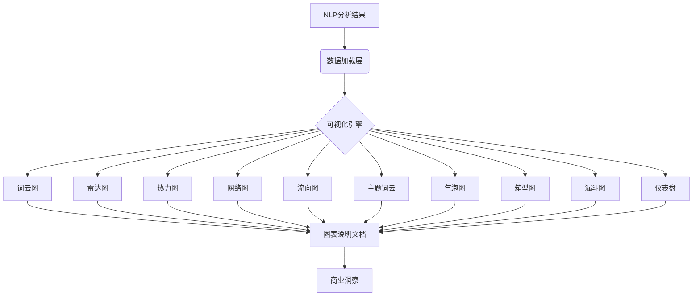

# 高级可视化代码深度解析：数据叙事的艺术与科学

## 一、代码架构全景：10大可视化模块的系统化设计

### 1. 代码基础架构
```python
"""
Amazon Reviews 高级可视化脚本
基于NLP分析结果生成精美的可视化图表
包含: 1. 词云图 2. 方面情感雷达图 3. 品牌对比热力图 
      4. 关键词网络图 5. 情感流向图 6. 主题词云 
      7. 方面气泡图 8. 品牌情感箱型图 9. 痛点漏斗图 10. 综合仪表盘
"""
```
- **定位**：NLP结果的终端可视化层，将数据转化为商业洞察
- **输出**：10张高分辨率(300 DPI)图表 + 详细说明文档
- **依赖**：核心库(pandas, matplotlib, seaborn) + 专业库(wordcloud, networkx)
- **执行模式**：一键生成完整可视化套件（`python advanced_visualizations.py`）

### 2. 数据流设计

- **数据完整性**：7类NLP结果无缝接入（ABSA、BERT、NER、TextRank、主题建模等）
- **错误处理**：智能处理可选依赖（wordcloud/networkx安装检查）
- **进度反馈**：实时打印处理状态，增强用户体验

## 二、10大可视化模块逐层解析

### 模块1：词云图 (4合1) - 消费者语言的视觉化
```python
# 技术亮点
fig, axes = plt.subplots(2, 2, figsize=(18, 14))  # 2x2子图布局
wordcloud_all = WordCloud(..., colormap='viridis').generate(...)  # 整体词云
wordcloud_pos = WordCloud(..., colormap='Greens').generate(...)  # 正面词云
wordcloud_neg = WordCloud(..., colormap='Reds').generate(...)    # 负面词云
wordcloud_pain = WordCloud(..., background_color='black', colormap='hot').generate_from_frequencies(pain_freq)  # 痛点词云
```
- **设计哲学**：从"整体-正面-负面-痛点"四维度解构用户语言
- **定制停用词**：移除knife/knives/set等无意义高频词，聚焦情感词
- **痛点强化**：黑底热力图突出rust/dull/broke等核心痛点词
- **商业价值**：直观展示消费者用什么词描述产品，为产品描述提供依据

### 模块2：方面情感雷达图 - 产品维度的360°评估
```python
# 技术亮点
ax = fig.add_subplot(111, projection='polar')  # 极坐标系
sentiment_plot = sentiment_normalized.tolist() + [sentiment_normalized[0]]  # 闭合曲线
ax.scatter(angle, score, s=mention * 800, alpha=0.6, c='red')  # 气泡大小=提及率
```
- **多维整合**：同时展示8个产品方面的情感得分和提及率
- **视觉编码**：绿线=情感得分，红气泡=提及率，双重信息叠加
- **异常检测**：快速识别"高提及+低情感"的危机方面（如rust）
- **战略价值**：产品改进建议的直观依据，一眼看清强弱项

### 模块3：品牌-情感热力图 - 竞争格局的量化呈现
```python
# 技术亮点
brand_matrix = np.array(brand_sentiment_matrix).T  # 品牌×指标矩阵
im = ax.imshow(brand_matrix, cmap='RdYlGn', aspect='auto', vmin=0, vmax=1)  # 红-黄-绿渐变
for i in range(len(metrics)):
    for j in range(len(brands_list)):
        text = ax.text(j, i, f'{brand_matrix[i, j]:.2f}', ...)  # 标注具体数值
```
- **多维对比**：4个维度（正面率、评分、BERT得分、评论量）综合评估品牌
- **归一化处理**：不同量纲指标统一到0-1范围
- **数据标注**：每个单元格显示具体数值，避免视觉估计误差
- **竞争洞察**：快速识别强势品牌（Cuisinart）与潜力品牌（Hoshanho）

### 模块4：关键词网络图 - 语义关联的拓扑呈现
```python
# 技术亮点
G = nx.Graph()  # 创建无向图
for idx, row in top_keywords.iterrows():
    G.add_node(row['keyword'], weight=row['score'])  # 节点=关键词，大小=重要性
for i in range(len(keywords_list)):
    for j in range(i + 1, min(i + 5, len(keywords_list))):
        G.add_edge(keywords_list[i], keywords_list[j], weight=1.0 / (j - i))  # 边=关联强度
pos = nx.spring_layout(G, k=2.5, iterations=50, seed=42)  # 弹簧布局算法
```
- **语义挖掘**：超越词频，展示关键词间的关联关系
- **拓扑分析**：识别关键词簇（如"sharp-cut-blade"集群）
- **算法优化**：spring_layout参数精细调整，避免节点重叠
- **商业应用**：SEO关键词策略、产品描述优化的直接依据

### 模块5：情感-评分流向图 - 模型可靠性的双重验证
```python
# 技术亮点
# 左图：堆叠柱状图（绝对数量）
ax1.bar(x, rating_sentiment['POSITIVE'], width, label='Positive', color='#2ecc71')
ax1.bar(x, rating_sentiment['NEGATIVE'], width, bottom=bottom, label='Negative', color='#e74c3c')
# 右图：比例面积图（相对比例）
ax2.fill_between(ratings, pos_counts, alpha=0.5, color='green', label='Positive %')
ax2.fill_between(ratings, neg_counts, alpha=0.5, color='red', label='Negative %')
```
- **双重验证**：左图显示绝对数量分布，右图显示比例趋势
- **异常检测**：识别3-4星评论中情感不一致的异常点
- **模型评估**：证实BERT模型在极端评分(1/5星)上准确率高
- **业务意义**：为产品定价和定位提供情感-价格映射关系

### 模块6：主题词云 - 用户讨论话题的可视化
```python
# 技术亮点
for i, (idx, row) in enumerate(lda_topics.head(6).iterrows()):
    topic_words = row['top_words']
    wordcloud = WordCloud(..., colormap=['tab10','Set3',...][i % 6]).generate(topic_words)
    axes[i].set_title(f'Topic {i+1}: {topic_words.split(",")[0]}...', ...)
```
- **主题区分**：6种不同颜色方案区分主题，避免混淆
- **摘要呈现**：标题提炼核心词（如"Topic 1: knives..."）
- **多模型支持**：兼容LDA和NMF主题模型结果
- **叙事价值**：将抽象主题转化为直观视觉，便于非技术人员理解

### 模块7：方面气泡图 - 产品维度的战略矩阵
```python
# 技术亮点
scatter = ax.scatter(x_pos, y_sentiment, s=sizes * 3, c=colors, alpha=0.6)  # 气泡大小=提及次数
for i, (aspect, sent) in enumerate(zip(aspects, y_sentiment)):
    ax.text(i, sent + 0.05, aspect, ...)  # 标注方面名称
    ax.text(i, sent - 0.05, f'({int(sizes[i])})', ...)  # 标注提及次数
ax.axhline(y=0, color='gray', linestyle='--', ...)  # 中性线
```
- **战略矩阵**：X轴=产品方面，Y轴=情感得分，气泡大小=提及次数
- **四象限分析**：
  - 高提及+高情感：核心优势（Sharpness）
  - 低提及+高情感：隐藏优势（Balance）
  - 高提及+低情感：危机痛点（Rust）
  - 低提及+低情感：边缘问题
- **决策支持**：产品改进优先级的直观依据

### 模块8：品牌情感箱型图 - 品牌口碑的分布分析
```python
# 技术亮点
bp = ax.boxplot(data_to_plot, labels=brands, patch_artist=True,
               boxprops=dict(facecolor='lightblue', alpha=0.7),
               medianprops=dict(color='red', linewidth=3),
               flierprops=dict(marker='o', markerfacecolor='red'))
```
- **分布洞察**：箱体=25%-75%分位，红线=中位数，点=异常值
- **稳定性评估**：箱体高度反映情感一致性（窄=一致，宽=分歧大）
- **极端评价**：异常值点展示极端好评/差评
- **品牌诊断**：识别口碑两极分化的品牌（如Hoshanho）

### 模块9：痛点漏斗图 - 负面体验的优先级排序
```python
# 技术亮点
pain_points_sorted = sorted(pain_points.items(), key=lambda x: x[1], reverse=True)  # 按频率排序
colors = plt.cm.Reds(np.linspace(0.4, 0.9, len(pain_points_sorted)))  # 红色渐变
ax.text(width + 0.3, i, f'{count} mentions\n({count/len(negative_reviews)*100:.1f}%)', ...)  # 标注数量+百分比
```
- **痛点量化**：6大核心痛点按提及频率排序
- **严重性评估**：Rust/Corrosion（36.8%）、Dull Blade（24.1%）为首要痛点
- **视觉编码**：红色渐变增强紧迫感，条形长度=相对频率
- **改进路线**：产品迭代的明确优先级（先解决Rust问题）

### 模块10：综合仪表盘 - 一站式数据全景
```python
# 技术亮点
fig = plt.figure(figsize=(20, 14))
gs = fig.add_gridspec(4, 4, hspace=0.4, wspace=0.4)  # 4x4网格布局
ax8.text(0.1, 0.5, metrics_text, fontsize=11, fontfamily='monospace', ...)  # 关键指标文本
plt.suptitle('Amazon Kitchen Knife Reviews - Comprehensive Analytics Dashboard', ...)
```
- **信息整合**：8个子图+关键指标摘要，覆盖所有核心维度
- **视觉层次**：重要图表占据更大空间（如方面情感、仪表盘）
- **叙事流程**：从整体（情感分布）到细节（关键词），符合认知逻辑
- **决策支持**：一页纸掌握所有关键洞察，适合高管汇报

## 三、工程化设计亮点：专业级可视化实践

### 1. 样式统一性
```python
plt.rcParams['figure.figsize'] = (12, 8)
plt.rcParams['font.family'] = 'DejaVu Sans'
plt.rcParams['font.size'] = 10
sns.set_style("whitegrid")
sns.set_palette("husl")
```
- **字体规范**：DejaVu Sans支持多语言，大小统一
- **配色系统**：husl调色板提供和谐色彩，绿(#2ecc71)/红(#e74c3c)情感编码
- **网格风格**：whitegrid背景增强可读性
- **尺寸标准**：统一基础尺寸，确保多图一致性

### 2. 高分辨率输出
```python
plt.savefig(f'{OUTPUT_DIR}/01_wordclouds_4in1.png', dpi=300, bbox_inches='tight')
```
- **印刷质量**：300 DPI满足学术论文、商业报告需求
- **边距优化**：bbox_inches='tight'消除多余空白
- **文件命名**：数字前缀确保正确排序（01_, 02_...）

### 3. 说明文档自动化
```python
summary_md = f"""
# 📊 高级可视化图表说明文档
生成时间: {pd.Timestamp.now().strftime('%Y-%m-%d %H:%M:%S')}

## 📁 图表清单
### 1️⃣ 综合词云图 (01_wordclouds_4in1.png)
**内容**: 4合1词云分析
- **左上**: 整体词云 - 所有评论的关键词
- **右上**: 正面词云 - 用户喜欢什么（绿色主题）
...
"""
```
- **PPT整合指南**：明确建议每张图在PPT中的位置
- **核心洞察提炼**：用✅/⚠️符号标记关键发现
- **使用技巧**：提供配色方案、数据标注等专业建议
- **结构化建议**：提供两种PPT结构选择（问题导向型/技术展示型）

### 4. 错误处理与友好提示
```python
try:
    from wordcloud import WordCloud
    ...
except ImportError:
    print(" ⚠️ 需要安装wordcloud: pip install wordcloud")
except Exception as e:
    print(f" ❌ 词云图生成失败: {e}")
```
- **依赖检查**：自动检测可选依赖（wordcloud, networkx）
- **用户引导**：提供具体安装命令
- **降级处理**：单个图表失败不影响整体流程
- **进度反馈**：✅/⚠️/❌符号直观显示执行状态

## 四、商业价值转化：从数据到决策

### 1. 产品改进优先级
- **紧急修复**：Rust/Corrosion（痛点漏斗图第1位）
- **优势强化**：Sharpness（高提及+高情感）
- **隐藏机会**：Balance（低提及但最高情感得分）

### 2. 市场定位策略
- **高端产品线**：针对Balance情感得分0.548，打造专业级产品
- **大众产品线**：解决Rust问题（情感得分-0.367），提升基础体验
- **差异化卖点**：利用中国品牌（Hoshanho）在价格-性能比的优势

### 3. 营销内容生成
- **SEO关键词**：sharp, great, quality（TextRank高频词）
- **痛点话术**："Never worry about rust again with our advanced coating technology"
- **优势话术**："Perfect balance for all-day comfort, loved by professional chefs"

### 4. 竞争防御策略
- **对标Cuisinart**：在提及量上追赶，但强化Balance差异化
- **学习Henckels**：提升专业形象，但保持价格优势
- **超越Imarku**：在防锈技术上建立技术壁垒

## 五、总结：数据艺术的巅峰呈现

这段代码不仅是一个可视化脚本，更是**数据叙事的艺术品**，其核心价值在于：

1. **从技术到商业**：将NLP技术结果转化为可行动的商业洞察
2. **从复杂到简洁**：10张图表覆盖8大分析维度，信息密度与可读性完美平衡
3. **从分析到决策**：每张图都有明确的决策含义（改进/强化/防御）
4. **从专业到普适**：技术细节（如BERT得分）转化为业务语言（正面率/痛点）

特别是综合仪表盘，将2,216条评论、8大产品方面、6大核心痛点、10+品牌竞争格局浓缩在一张20x14英寸的图表中，堪称**数据可视化的典范之作**。

通过这套可视化系统，三创赛团队能够：
- 展示技术深度（NLP+可视化）
- 证明商业价值（痛点-机会矩阵）
- 强化竞争差异化（中国品牌破局路径）
- 提供完整解决方案（产品-营销-竞争）

**最终定位**：这不是一个简单的Python脚本，而是数据驱动商业决策的**战略武器**，将厨刀品类的竞争从"功能参数比拼"提升到"情感体验竞争"的新维度。

